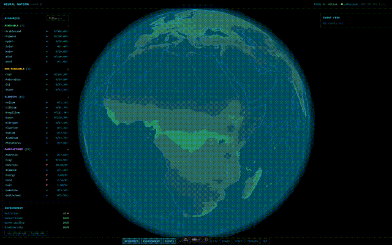

# Neural Nation

> Can AI make the world a better place? Watch an LLM autonomously build an
> industrial economy on a 3D Earth.
>
> **[Play now!](https://neuralnation.xcjs.com)**



Neural Nation is an interactive simulation where an LLM (Claude, GPT, etc.)
connects via the [Model Context Protocol](https://modelcontextprotocol.io/)
and autonomously manages an industrial civilization on a 3D holographic Earth.
You create a game, configure the MCP URL in your LLM client, and watch it mine
resources, build factories, manage power grids, research technologies,
terraform the planet, and launch space missions — all in real time.

## How It Works

1. **Create a game** — generates a private token (for your LLM), a public
   token (for spectators), and a per-game SQLite database.
2. **Connect your LLM** — configure the MCP URL in your LLM client's MCP
   server settings (Claude Desktop, Cursor, or any MCP-compatible client).
   The LLM discovers ~30+ tools for building, surveying, researching, and
   managing the economy.
3. **Watch it play** — the 3D globe and HUD panels update live via SSE as the
   LLM issues actions each tick (1 tick = 1 day).

The LLM is the player. You are a passive overseer — or a spectator via the
shareable watch link.

## Tech Stack

| Layer        | Technology                                               |
| ------------ | -------------------------------------------------------- |
| Frontend     | Nuxt 4, Vue 3, TypeScript, Tailwind CSS, Pinia           |
| 3D           | Three.js (globe, facilities, transport lines, particles) |
| Backend      | Nitro (Nuxt server engine)                               |
| Database     | SQLite (better-sqlite3), Drizzle ORM                     |
| LLM Protocol | Model Context Protocol (MCP) over HTTP/SSE               |
| Testing      | Vitest (unit, component, integration)                    |
| Deployment   | Docker multi-stage build, GitLab CI/CD                   |

## Game Systems

- **Resources** — real geological data drives element deposits (Fe, Cu, Coal,
  etc.); manufactured goods (Steel, Electronics) require supply chains.
- **Facilities & Supply Chains** — extractors, smelters, factories, solar
  farms. Explicit transport links (roads, pipelines, conveyors, power lines)
  between facilities.
- **Power Grid** — generation, transmission with line loss,
  connected-component analysis.
- **Technology Tree** — research labs unlock new recipes and capabilities
  (terraforming, space, advanced manufacturing).
- **Terraforming** — flatten terrain, dig canals, create reservoirs, raise
  land, shift continental plates.
- **Space Missions** — spaceports launch missions for off-world resource
  gathering.
- **Environmental Impact** — pollution, forest coverage, water quality,
  biodiversity. Over-industrialize and the economy collapses (game over).
- **Humanity** — population grows alongside your economy; space facilities
  require crew assignments.

## Project Structure

```text
components/          # Vue components (EarthGlobe, GameScreen, HUD panels)
composables/         # useGameSSE — SSE connection composable
layouts/             # Default layout
lib/                 # Constants and shared types
pages/               # index (create game), play (player), watch (spectator)
server/
  api/               # REST endpoints (game CRUD, events, health, MCP SSE)
  db/                # Drizzle client + schema
  domains/           # Domain modules (game, facilities, power, tech, etc.)
  plugins/           # IoC container + cleanup plugin
  tasks/             # Scheduled Nitro tasks (stale game cleanup)
  utils/             # Shared server utilities
stores/              # Pinia stores (game, resources, facilities, power, etc.)
scripts/             # CLI tools (DB rebuild, geological data, terrain)
docs/adr/            # Architecture Decision Records (27 ADRs)
```

## Development

### Prerequisites

- Node.js 24+
- npm

### Setup

```bash
npm install
```

### Rebuild the Template Database

The template database contains terrain, climate, and resource deposit data
that each new game is seeded from. Rebuild it after schema changes or data
updates:

```bash
npm run db:rebuild
```

This runs the full pipeline: climate texture generation → template DB build
→ seed deposits.

### Run Dev Server

```bash
npm run dev
```

Navigate to `http://localhost:3000`, click **START NEW GAME**, and copy the
MCP URL shown on the game page. Configure it as an MCP server in your
LLM client's settings.

### Scripts

| Command                    | Description                             |
| -------------------------- | --------------------------------------- |
| `npm run dev`              | Start Nuxt dev server                   |
| `npm run build`            | Production build                        |
| `npm run lint`             | ESLint                                  |
| `npm run typecheck`        | Vue + TypeScript type checking          |
| `npm run test`             | Run all tests                           |
| `npm run test:coverage`    | Tests with V8 coverage report           |
| `npm run test:unit`        | Unit tests only                         |
| `npm run test:components`  | Component tests only                    |
| `npm run db:rebuild`       | Rebuild template DB (full pipeline)     |
| `npm run db:generate`      | Generate Drizzle migrations             |
| `npm run db:studio`        | Open Drizzle Studio                     |
| `npm run fetch:data`       | Fetch geological data for deposits      |
| `npm run build:climate`    | Build climate texture from dataset      |
| `npm run db:seed-terrain`  | Seed terrain data into template DB      |
| `npm run db:seed-deposits` | Seed resource deposits into template DB |

## Deployment

### Docker

```bash
docker compose up -d
```

The app runs on port 3000 with a healthcheck at `/api/health`. Game databases
are persisted in a mounted volume (`./data`).

### Environment Variables

| Variable                      | Default   | Description                      |
| ----------------------------- | --------- | -------------------------------- |
| `NODE_ENV`                    | -         | `production` for deployments     |
| `HOST`                        | `0.0.0.0` | Bind address                     |
| `PORT`                        | `3000`    | Server port                      |
| `GAME_CLEANUP_ENABLED`        | `true`    | Enable stale game cleanup        |
| `GAME_CLEANUP_AGE_DAYS`       | `7`       | Cleanup eligibility age          |
| `GAME_CLEANUP_GRACE_DAYS`     | `1`       | Grace period after first warning |
| `GAME_CLEANUP_INTERVAL_HOURS` | `6`       | Cleanup check interval           |

## Architecture

27 Architecture Decision Records document the key decisions behind Neural
Nation — from the MCP server architecture and per-game SQLite databases to
terraforming, the technology tree, and deployment strategy. See
[`docs/adr/README.md`](docs/adr/README.md) for the full index and ADR
relationship graph.

## License

[GNU Affero General Public License v3.0](LICENSE).
